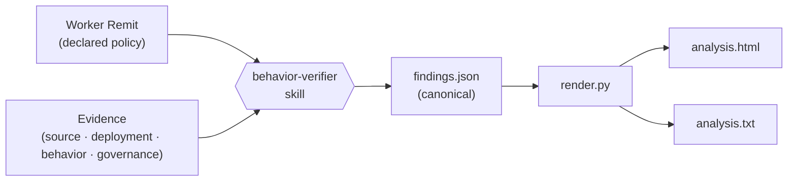

<!--
  Copyright 2026 Exabeam, Inc.
  SPDX-License-Identifier: Apache-2.0
-->

# Praxen Documentation

**Praxen** is the open-source reference implementation of **Agent Behavior Verification (ABV)** — a proactive control model for AI agents and digital workers. It compares an AI agent's declared policy (a Worker Remit) against whatever evidence is available about that agent — source code, live deployment state, behavioral artifacts, governance docs, or any mix — and reports where observed behavior diverges from declared intent.

> *Make sure your agent does its job — and only its job.*

*Praxen is a project sponsored by [Exabeam](https://www.exabeam.com/).*

---

## Where to start

| If you are… | Read this first |
|---|---|
| Setting up Praxen for the first time | [Installation](installation.md) |
| Trying it out for the first time | [Quickstart](quickstart.md) — first report against the bundled `finbot` example in five minutes |
| Ready to run your first real analysis | [Usage](usage.md) |
| Writing a Worker Remit for an agent | [Writing Worker Remits](writing-remits.md) |
| Looking at a report and trying to understand it | [Interpreting Reports](interpreting-reports.md) |
| Disagreeing with a finding or wanting to revise it | [Challenging and Revising Findings](challenging-findings.md) |
| Wondering why two runs gave slightly different scores | [Understanding Run-to-Run Variability](understanding-variability.md) |
| Hit a problem on a first run | [Usage § Troubleshooting](usage.md#troubleshooting) |
| Trying to understand the OWASP frameworks Praxen tags against | [OWASP Gen AI Security](owasp.md) |
| Trying to understand the RAISE maturity scoring | [The RAISE Framework](RAISE.md) |

---

## How Praxen Works (in 90 seconds)

Praxen reduces agent verification to a single comparison:

1. **You declare what the agent is supposed to do** in a [Worker Remit](writing-remits.md). This is the only artifact you customize per agent.
2. **You point Praxen at evidence about the agent** — its source code, live deployment files, conversation logs, or any combination.
3. **Praxen reads, compares, reports.** Every finding traces to a specific rule in the Worker Remit it violates, with evidence cited from the input.

The output is a self-contained HTML analysis report, a machine-readable JSON findings file, and a plain-text summary. Open the HTML in a browser; ingest the JSON in your pipeline.

---

## Four Input Shapes

Praxen is **not just a source-code analyzer.** Any of these — alone or in combination — are valid input:

- **Source repository** — a project directory, GitHub repo, or plugin source tree.
- **Running deployment** — live memory and bootstrap files (`MEMORY.md`, `SOUL.md`), operational logs (action reports, session JSONL, audit trails, escalation logs), live config.
- **Behavioral artifacts** — chat transcripts, email histories, conversation logs, decision records.
- **Governance & methodology docs** — red-team reports, threat models, runbooks, incident retrospectives, dependency-management policy. These feed the maturity-oriented RAISE categories (Build an AI Red Team, Monitor Continuously, Manage Your Supply Chain) that source code alone can't speak to.

The methodology adapts. Categories the input doesn't cover are scored at lower confidence and explicitly noted in the report. See [Usage](usage.md) for how to point Praxen at each type.

---

## Frameworks

Every finding Praxen produces is classified against four industry-standard frameworks simultaneously:

- **OWASP Top 10 for LLM Applications 2025** — `LLM01`–`LLM10` tags
- **OWASP Top 10 for Agentic AI Applications 2026** — `ASI01`–`ASI10` tags
- **OWASP Secure MCP Server Development Guide 2026** — applied when MCP configuration is found
- **RAISE Framework** — six-category 0–5 maturity score; see [RAISE](RAISE.md)

For an overview of the OWASP Gen AI Security Project and a one-line gloss on each LLM, Agentic, and MCP risk, see [OWASP Gen AI Security](owasp.md).

---

## Quick reference

- Install: `claude plugin marketplace add open-agent-ai-security/praxen` then `claude plugin install praxen@open-agent-ai-security` (or the in-session `/plugin ...` equivalents — see [Installation](installation.md))
- Skill name: `behavior-verifier`
- Output directory: `./reports/` relative to where you run the analysis
- Output files: `<agent>-analysis-<timestamp>.html`, `<agent>-findings-<date>.json`, `<agent>-analysis-<timestamp>.txt`

For the full specification, see [`PRAXEN_SPEC.md`](../PRAXEN_SPEC.md) at the repo root.
