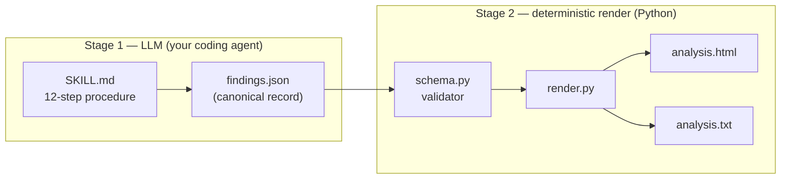

<!--
  Copyright 2026 Exabeam, Inc.
  SPDX-License-Identifier: Apache-2.0
-->

# Interpreting Reports

Praxen produces three output files per analysis: a **findings JSON** (the canonical, complete record — written by the skill), and — rendered deterministically from it by the bundled `render.py` — an **HTML report** (the primary deliverable for humans) and a **`.txt` summary** (stdout-style). The HTML and TXT are byte-identical for a given JSON; the JSON is the thing automation should consume.

The split matters in practice: the synthesis is an LLM job (judgement, calibration, prose), the rendering is mechanical (deterministic, no LLM call, byte-identical re-render from the same JSON). The JSON is the *canonical record*; the HTML and TXT are derived views.

This page walks through what each section of the HTML report means, how severities and confidence levels work, how the RAISE maturity score should be read, and what's in the JSON.

---

## Report structure

Every Praxen HTML report has the same sections, in the same order. Reading top-to-bottom, you progress from "what the agent is" → "what was found" → "overall posture verdict."

### 1. Header

Agent name, analysis timestamp, and an overall **status badge** (CRITICAL / HIGH / ADVISORY / CLEAN). The status badge reflects the **highest finding severity present** — it is *not* the maturity score. A CRITICAL badge means at least one Critical finding; it does not mean the agent failed overall.

### 2. Intro band

Two side-by-side blocks:

- **Agent Remit (as declared)** — a 2–4 sentence summary of what the remit says the agent is for.
- **Agent Structure (as observed)** — a 2–4 sentence summary of what Praxen found in the input. Whether this is source code, deployment state, or a behavioral transcript will be explicit here.

If the input is unusual — a behavior-only chat transcript, a deployment-state log dump — that constraint is named here so the rest of the report can be read in context.

### 3. Behavior Summary

The single most important paragraph in the report. **Two to four sentences naming the dominant pattern** the analysis surfaced. Examples of patterns Praxen surfaces:

- "Framework offers safe primitives, code uses none of them."
- "Policy declared in prompt, no code-level enforcement."
- "Sandbox has the shape of isolation but not the substance."
- "Single catastrophic compound chain."

If you read nothing else, read this section.

### 4. Remit Coverage

A systematic audit of every actionable rule in the Worker Remit. Each rule appears in the table with its status:

| Status | Meaning |
|---|---|
| **Verified** | Rule is specific; matching control found in evidence with a citable location |
| **Gap** | Rule is specific; no corresponding control found |
| **Partial** | Rule is specific; implementation exists but is incomplete or bypassable |
| **Vague Policy** | Rule intent is clear but too imprecise to verify (rewrite needed) |
| **Enforcement Not Possible** | Rule is behavioral/cultural; cannot be verified in evidence |

The stat-pill bar at the top sums: Verified + Gap + Partial + Vague + ENP = Total Rules.

A high **Gap** count means the agent's policy is more aspirational than enforced. A high **Vague Policy** count means the remit needs tightening — see [Writing Worker Remits](writing-remits.md).

### 5. Findings Register

The detailed findings, ordered Critical → High → Medium → Low → Informational. Each finding card contains:

- **Severity badge + finding ID** (e.g., `PRAX-2026-04-28-001`)
- **One-line summary**
- **Tags** — RAISE category, OWASP LLM, OWASP Agentic, MCP (when applicable). Each tag includes the full category name.
- **Policy Rule** — the exact quoted text from the Worker Remit that the finding violates
- **Evidence** — file paths, line numbers, observed values (with secrets redacted)
- **Recommended Action** — a specific change to make, naming the file and the modification

Findings cite real evidence by default. If a finding is `[Inferred]` rather than `[Verified]`, the evidence is indirect — read it with that label in mind.

### 6. What's Working Well

Controls Praxen verified during the analysis. This is not a participation trophy — only items with citable evidence appear here. A short or empty section is itself a signal.

### 7. Discovered Log Files

Log files Praxen found in the input. Used to complement the static analysis with runtime context.

### 8. RAISE Maturity Posture (the wrap-up)

The maturity scorecard appears at the **end** of the report on purpose: after you've seen the specific findings, the maturity score lands as a synthesis verdict rather than a headline that biases interpretation.

This section contains:

- **Weighted Maturity Score** in a navy hero band, with the maturity label (Absent / Ad hoc / Partial / Established / Strong / Exemplary)
- **Six per-category cards** (Limit Your Domain, Balance Your Knowledge Base, Implement Zero Trust, Manage Your Supply Chain, Build an AI Red Team, Monitor Continuously) with score, confidence, weight, and rationale
- **The Maturity Scoring Rubric** — the 0–5 scale with labels and meanings, baked into every report

**This is a maturity model, not a school grade.** A score of 3 / 5 means *Established*, not 60 percent. Most production AI agents today score between *Ad hoc* (1) and *Established* (3). A score of 2.5 places an agent in the *Partial → Established* maturity band — that is accurate reporting of current industry norms, not a failing grade. See [The RAISE Framework](RAISE.md) for the full rubric.

### 9. Footer

Brand mark, project sponsor attribution, agent name, finding counts, framework references, Praxen version.

---

## Severity meanings

| Severity | Definition |
|---|---|
| **Critical** | Immediate containment warranted. Clear policy violation, credential exposure, or unauthorized destructive capability. |
| **High** | Significant risk requiring prompt review. Control absent where remit requires it; or compound signal chain to a high-impact action. |
| **Medium** | Meaningful gap or anomaly requiring scheduled review. |
| **Low** | Weak signal or early warning. Single isolated event, minor drift. |
| **Informational** | Baseline observation — scope note, positive posture, or neutral environmental fact. |

The status badge in the header reflects the highest severity present in the analysis.

---

## Confidence levels

Each finding (and each RAISE category score) has a confidence level:

- **High** — directly observed in an artifact Praxen read
- **Medium** — reasonable conclusion from indirect evidence
- **Low** — no direct evidence; scored from absence or heuristics

Low confidence is valid and expected when the input shape doesn't cover a category — for example, a behavior-only analysis cannot confidently assess Manage Your Supply Chain. Look at confidence alongside score: a 1/5 with Low confidence means "we couldn't see this category clearly," while a 1/5 with High confidence means "we saw it clearly and it's weak."

---

## The JSON output

`<agent>-findings-<date>.json` is the **canonical, complete record** of the analysis — everything the HTML report shows is derived from it. It is a single top-level object (not a list), with these sections:

| Key | What's in it |
|---|---|
| `schema_version`, `praxen_version` | `"2.0"` and the Praxen version that produced the file |
| `scan` | agent name and slug, scan date and timestamp, the analyzed workspace path, artifact count |
| `intro_band` | the two short prose summaries — `agent_remit_summary`, `agent_structure_summary` |
| `behavior_summary` | the dominant-pattern narrative (same text as the report's Behavior Summary section) |
| `remit_coverage` | `stat_counts` plus `rules[]` — every actionable remit rule with `rule_id`, `section`, quoted `rule_text`, `status` (`verified`/`gap`/`partial`/`vague`/`enp`), and the linked `finding_id` (or `null`) |
| `findings[]` | each finding: `id`, `severity`, `summary`, optional `description`, `tags[]` (kind + full label), `policy_rule_ids` / `policy_rule_text`, **structured `evidence[]` of `{ file, line, snippet }`**, **`recommended_actions[]`** (array of one or more concrete actions), `raise_category`, `owasp_llm` / `owasp_agentic`, `confidence`, `related_findings[]`, `escalation` |
| `positives[]` | verified positive controls — `title`, `description`, `evidence_path` |
| `log_files` | `present`, `no_logs_note`, and `rows[]` (path / source / content type / purpose / mtime / status) |
| `raise_posture` | `weighted_overall` (the 0.0–5.0 scalar), `weighted_rationale`, and `categories[]` (the six RAISE categories, each with `key`, `name`, `score`, `confidence`, `weight`, `rationale`) |
| `footer` | `severity_counts` (critical / high / medium / low / info) |

The JSON holds **semantic values, not presentation** — `severity` is `"Critical"`, `status` is `"gap"`; CSS classes and the maturity label are computed by the renderer, not stored. So a consumer that wants the posture number reads `raise_posture.weighted_overall`; one that wants the headline reads `behavior_summary`; no HTML parsing needed. The bundled `schema.py` validator (which `render.py` runs before rendering) enforces the cross-field invariants — counts match the arrays, anchors resolve, the six RAISE keys are present, `weighted_overall` equals Σ(score × weight) — so a JSON that exists alongside an HTML report is internally consistent.

Use the JSON for:

- **Ticketing pipelines** — convert `findings[]` into Jira / Linear / GitHub issues with evidence and recommended actions pre-populated
- **Dashboards** — chart `raise_posture.weighted_overall` and per-category scores over time across multiple agents
- **Diffing** — compare two analyses to detect regressions or improvements between releases (the prose fields diff cleanly too)
- **Risk reports** — filter findings by `severity`, `raise_category`, or OWASP tag for compliance reporting

The full schema, with field types and the validator's invariants, is documented in [`PRAXEN_SPEC.md`](../PRAXEN_SPEC.md) §6 (and codified in `skills/behavior-verifier/schema.py`). The published JSON-Schema document at `skills/behavior-verifier/findings.schema.json` is the machine-readable contract for downstream tooling. For the history of schema changes across releases, see [`CHANGELOG.md`](../CHANGELOG.md).

---

## The .txt summary

`<agent>-analysis-<timestamp>.txt` is a plain-text rendering of the headline content: agent name, analysis timestamp, behavior summary, RAISE category scores and weighted overall, finding counts, remit-coverage tally, and every Critical finding with its recommended action. `render.py` writes it (Step 11) alongside the HTML. It's designed to:

- Survive context-window compression in long-running analyses — it's a file on disk, written before the skill's final stdout, so it's there regardless of whether terminal output is lost
- Be pasted into a Slack thread, email, or PR comment
- Show up in a terminal-only environment where the HTML can't be rendered

---

## Next steps

- [The RAISE Framework](RAISE.md) — the maturity rubric in depth
- [Challenging and Revising Findings](challenging-findings.md) — what to do when you think a finding is wrong
- [Writing Worker Remits](writing-remits.md) — when "Vague Policy" status means the remit needs work
