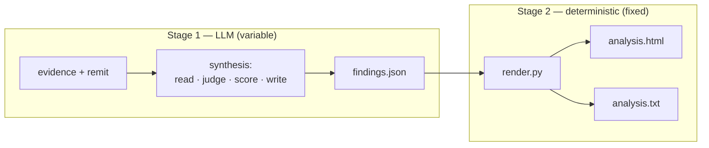

<!--
  Copyright 2026 Exabeam, Inc.
  SPDX-License-Identifier: Apache-2.0
-->

# Understanding Run-to-Run Variability

Run Praxen twice on the *same* agent, with the *same* Worker Remit and the *same* evidence, and the two reports will not be byte-identical. The big findings will be the same; the exact severity counts and the weighted RAISE score may shift a little. This is expected, and this page explains why, how much to expect, and what to do when you need a more stable number.

## Where the variability comes from

A Praxen analysis has two stages, and only one of them is variable.

**Stage 1 — synthesis — is done by a large language model** (your coding agent running the `behavior-verifier` skill). Reading the code, deciding what is and isn't a finding, judging severity, and assigning the six RAISE category scores are all *acts of judgement*. The same model given the same evidence will not make every borderline call identically every time — the same way two equally-qualified human reviewers, or the same reviewer on two different days, would write similar-but-not-identical reports. This is inherent to the task, not a defect.

**Stage 2 — rendering — is deterministic.** `render.py` turns the findings JSON into the HTML and TXT views with no model involved; the same JSON always produces byte-identical output. None of the variability lives here. (See [Interpreting Reports](interpreting-reports.md) for the full two-stage picture.)

So the variability you see is entirely the variability of the **synthesis**, captured in `findings.json`.

### Two flavours: variance and drift

- **Variance** — run-to-run scatter on a *fixed* model. Re-running the same analysis lands in a slightly different place each time.
- **Drift** — a *systematic* shift when the underlying model changes (a model upgrade, a different model tier). A newer model may, for example, credit a partially-implemented control slightly more or less generously than the one before it. Drift moves the centre point; variance is the scatter around it.

Both are normal. Both are larger for *judgement-sensitive* targets (see below) and smaller for clear-cut ones.

## How much to expect

The stable signal is the **finding set**; the noisy signal is the **exact numbers**.

| What | Stability | What to expect |
|---|---|---|
| **Dominant findings / themes** | **High** | The material findings — the Criticals, the headline divergences — reproduce run to run. If a finding is real, it shows up every time. |
| **Severity counts** (C/H/M/L/I) | Moderate | Expect a swing of roughly **±2–3 in a bucket** between runs, mostly from Critical↔High reclassification and borderline finding consolidation. |
| **Weighted RAISE score** | Moderate | Typically within **±0.3** of its centre, occasionally up to **±0.5** for judgement-sensitive targets — usually less than half a maturity-band step. |
| **Per-category 0–5 scores** | Lower at the margins | The `0↔1` ("absent vs ad-hoc") and `2↔3` ("partial vs established") boundaries are where most of the wobble lives. |
| **Rendered HTML / TXT** | Exact | Byte-identical for a given JSON. No variability. |
| **`R-NN` rule IDs** | Run-local | The rule numbering is re-derived each run; the *same* remit clause can get a different `R-NN` in two runs. Compare by rule **text**, not ID. |

**Judgement-sensitive targets vary more.** Where a target has *operative-but-imperfect controls* — a framework that ships guardrails the example doesn't wire up, a sandbox with permissive defaults, a partial mitigation — the "how much credit does this earn?" call is genuinely ambiguous, and that's where the weighted score moves most between runs. Deliberately-insecure agents (everything missing) and well-engineered agents (controls clearly present and operative) are the *most* reproducible, because there's little to debate. Targets in the messy middle are the least.

**Read the themes, not the decimal.** A weighted score of 1.3 on one run and 1.5 on the next is the *same posture* described with normal judgement scatter. A maturity **label** that changes (e.g. *Ad hoc* ↔ *Partial*) right at a band boundary is the same story — the boundary is a round number, not a cliff. What should *not* change between runs is the set of material findings and the Critical themes; if those move, that's signal, not noise.

## Following up with the LLM

Because the synthesis is an LLM step, you can **interrogate and revise it in conversation** — the report is a starting point, not a verdict. In the same session that produced the analysis (or a new one pointed at the same inputs), you can ask the coding agent to:

- **Explain a call** — *"Why did you score Implement Zero Trust 1 and not 2?"* or *"What evidence backs finding PRAX-…-004?"*
- **Re-examine a specific finding** — *"Re-check the `/read-only` finding against `commands.py`; is the severity right?"* The agent re-reads the artifact and either confirms or revises.
- **Challenge a score** — if you believe a control was under- or over-credited, say so with the file/line; the agent can re-evaluate that category and re-emit the findings JSON.
- **Re-run the whole analysis** — ask for a fresh pass to see whether a borderline result reproduces.

This is the intended workflow for disagreements and close calls. See [Challenging and Revising Findings](challenging-findings.md) for how revisions flow back into the canonical JSON (and why you edit the manifest/JSON and re-render rather than hand-editing the HTML).

## When stability matters more than runtime

A single run is the right default — it's fast and cheap, and for reading an agent's posture the themes are what matter. But when the *number itself* matters — gating a release, freezing a baseline, comparing before-and-after, or reporting a maturity score to a stakeholder — trade some runtime and token cost for stability:

1. **Run the analysis N times** (3 is a good default) on identical inputs. Keep the Worker Remit and the analyzed scope *byte-identical* across runs so you're measuring synthesis variance, not input differences.
2. **Aggregate the score** — report the **median (or mean) weighted score**, and note the **range**. A target whose three runs land at 1.3 / 1.4 / 1.3 is well-characterised; one that lands 1.0 / 1.6 / 1.2 is telling you it's judgement-sensitive — report the spread, don't pretend the single number is precise.
3. **Union the findings** — take the set of material findings that appear across runs. A Critical that appears in all three is solid; one that appears in one of three is worth a closer look (often a real edge case, occasionally an over-call) — a good candidate to [follow up with the LLM](#following-up-with-the-llm).
4. **Diff by theme and rule text, not by score or rule ID.** Run-to-run, compare which Critical themes are present and which remit clauses are flagged; ignore `R-NN` renumbering and small decimal moves.

The cost is real and linear: three runs is roughly three times the tokens and wall-clock of one. Spend it when a stable, defensible number is worth more than the runtime — and skip it for exploratory or one-off reads, where a single run and a focus on the findings is enough.

> **Rule of thumb.** One run to *understand* an agent; multiple runs to *grade* one.

## What is **not** variable

To be clear about the guarantees:

- **Rendering is deterministic** — same JSON → byte-identical HTML/TXT, every time.
- **The schema is fixed** — every report has the same sections, the same six RAISE categories, the same OWASP tag vocabulary.
- **Real findings reproduce** — a genuine Critical does not vanish on the next run. Disappearing material findings or dropped Critical themes are *not* normal variance; treat them as something to investigate.

## Next steps

- [Interpreting Reports](interpreting-reports.md) — what each section means and how to read the maturity score
- [Challenging and Revising Findings](challenging-findings.md) — the full revise-and-re-render workflow
- [The RAISE Framework](RAISE.md) — the six-category 0–5 maturity scale the weighted score is built from
